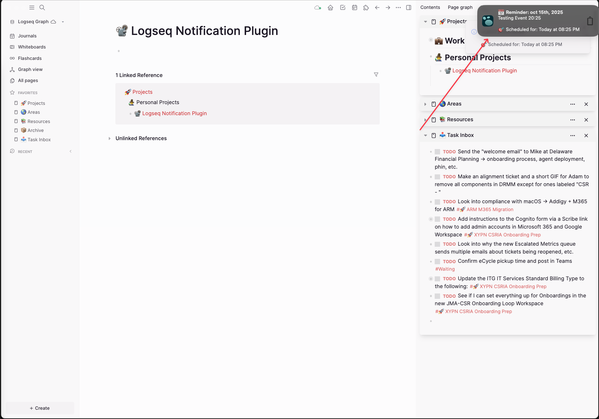
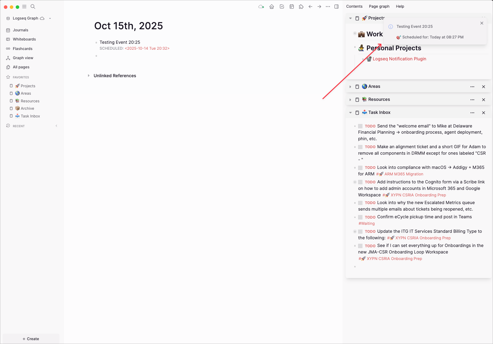

# Logseq Reminder Notifications Plugin

**v1.3.0 - FEATURE RELEASE** 🚀

  

Desktop and in-app notifications for scheduled blocks in Logseq. Never miss your scheduled tasks and reminders again!

## 🎬 Demo

<!-- TODO: Add screenshots/GIF showing:
1. Desktop notification popup
2. In-app notification in Logseq
3. Plugin working with scheduled block
-->


*Desktop notification and in-app message for scheduled reminders*

## ✨ Key Features

## 🎯 Current Status

✅ **WORKING FEATURES:**
- 🔔 Desktop notifications for scheduled blocks
- 📱 In-app toast messages  
- ⚡ Automatic block detection and parsing
- 🕒 Reliable notification timing
- 📋 Manual rescan via `/reminders: rescan` command
- 🔍 Smart parsing of `SCHEDULED: <timestamp>` formats
- 🛡️ Duplicate notification prevention
- ⏰ Past event filtering (ignores events older than 5 minutes)

✅ **NEW IN v1.3.0:**
- ⚙️ Settings GUI (Logseq-native)
- ⏱️ Multiple reminder intervals (comma-separated, e.g., `15,5,0`)
- 📅 All-day reminders with configurable time (e.g., `09:00`)
- 🔁 Polling interval and daily rescan hour configurable
- 🔔 Refreshed bell icon for desktop notifications

🚧 **Planned (not yet implemented):**
- Quiet hours configuration

## Installation

1. **Download this repository:**
   ```bash
   git clone https://github.com/Joemnewton/logseq-reminder-notifications.git
   ```

2. **Load in Logseq:**
   - Settings → Plugins → "Load unpacked plugin"
   - Select the `logseq-reminder-notifications` folder
   - Enable the plugin

3. **Grant permissions:**
   - Allow notifications when prompted
   - Check browser notification settings if needed

## Usage

### Supported Formats

**Journal-style timestamps (RECOMMENDED):**
```
SCHEDULED: <2025-10-14 Mon 14:30> Call the dentist
SCHEDULED: <2025-10-15 Tue 09:00> Team meeting
```

**Property-based scheduling:**
```
- Call the dentist
  scheduled:: 2025-10-14 14:30
```

### Commands

- `/reminders: rescan` - Manually refresh reminder list

## 📺 Screenshots

### Desktop Notifications

*Native desktop notification that appears even when Logseq is minimized*

### In-App Notifications  

*Toast message that appears within Logseq when you're actively using the app*

### Console Output (Optional)
For debugging, you can view plugin activity in the browser console (F12 → Console tab):
- Plugin startup messages
- Block scanning and detection logs  
- Notification trigger events

## Configuration

Open Logseq → Settings → Plugins → Reminder Notifications.

Settings:
- `Default Reminder Intervals` (string): Comma-separated minutes before event, e.g. `5,0` or `15,5,0`
- `Enable All-Day Reminders` (boolean): Enable reminders for date-only schedules
- `All-Day Reminder Time` (string): Time for all-day reminders, e.g. `09:00`
- `Polling Interval (seconds)` (number): How often to check due reminders
- `Daily Rescan Hour` (number): Hour of day to re-scan database

## 🔧 What’s New (v1.3.0)

- ✅ Added full Settings GUI using `logseq.useSettingsSchema()`
- ✅ Configurable reminder intervals (comma-separated input)
- ✅ Optional all-day reminders with custom time
- ✅ Configurable polling interval and daily rescan hour
- ✅ Updated desktop notification icon to a bell

## Troubleshooting

**No notifications?**
1. Check browser console (F12) for error messages
2. Run `/reminders: rescan` to refresh
3. Verify your block uses supported timestamp format:
   - ✅ `SCHEDULED: <2025-10-14 Mon 14:30> Task`
   - ❌ `SCHEDULED: <2025-10-14> Task` (no time)

**Console debugging:**
- Look for `🔔 Reminder Notifications plugin v1.3.0 starting...`
- Check for detailed parsing messages when running rescan

## Development Roadmap

Upcoming ideas:

1. Quiet hours configuration
2. Notification templates and sounds
3. Advanced overdue handling and snooze

## Contributing

1. Fork this repository
2. Test your changes thoroughly
3. Submit a pull request with clear description

## License

MIT License - See LICENSE file for details.

## Support

For issues:
1. Check browser console for errors
2. Include your Logseq version and block format
3. Create an issue on GitHub with reproduction steps